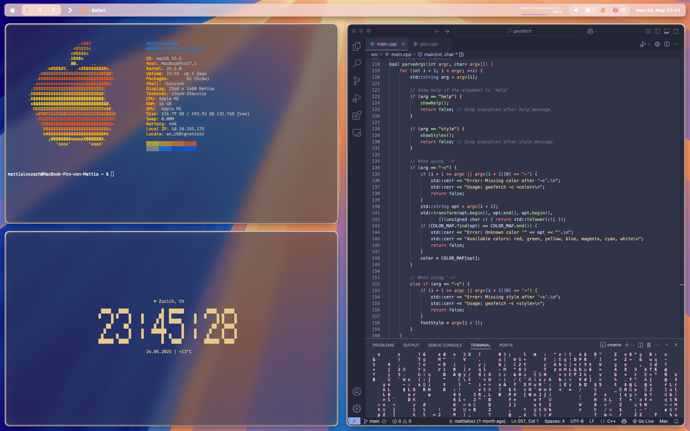
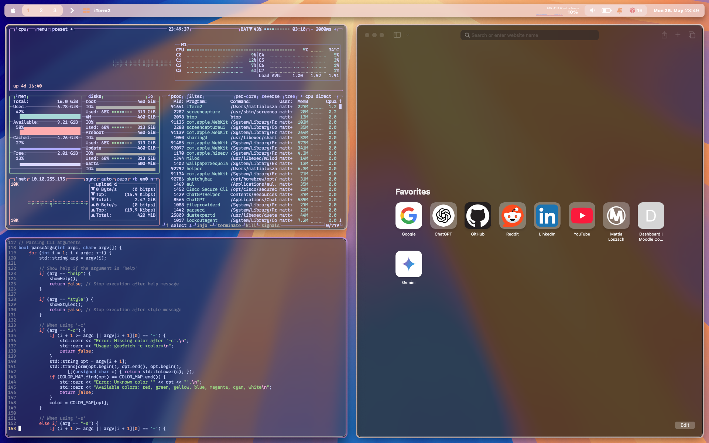
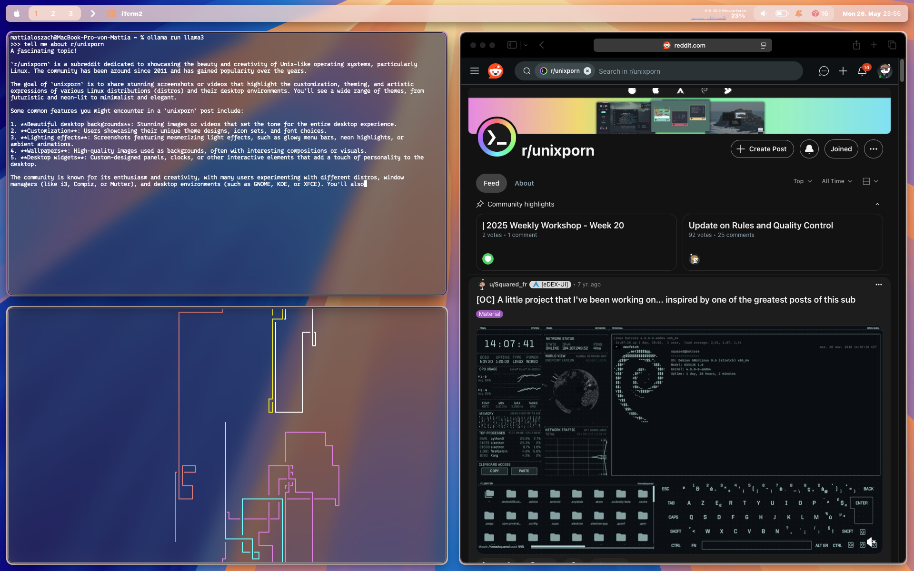

# Current Setup for MacOS Sequoia (June 2025)
Every now and then I come back to ricing my MacOS. These are my current configurations (June 2025) customized to my personal preferences and needs.

- **Terminal:** [iTerm2](https://github.com/gnachman/iTerm2?tab=readme-ov-file)
- **Window Manager:** [Yabai](https://github.com/koekeishiya/yabai) & [Rectangle](https://github.com/rxhanson/Rectangle)
- **Wallpaper:** Standard MacOS Sequoia (Light) Wallpaper
- **Main Color Theme:** [Cattpuccin Frappé](https://catppuccin.com/palette/)
- **Package Manager:** [Homebrew](https://github.com/Homebrew/brew)
- **Fonts:** SF Mono & Hack Nerd Font
- **Borders:** [JankyBorders](https://github.com/FelixKratz/JankyBorders)
- **Status Bar:** [Sketchybar](https://github.com/FelixKratz/SketchyBar)
- **Hotkeys:** [skhd](https://github.com/koekeishiya/skhd)

